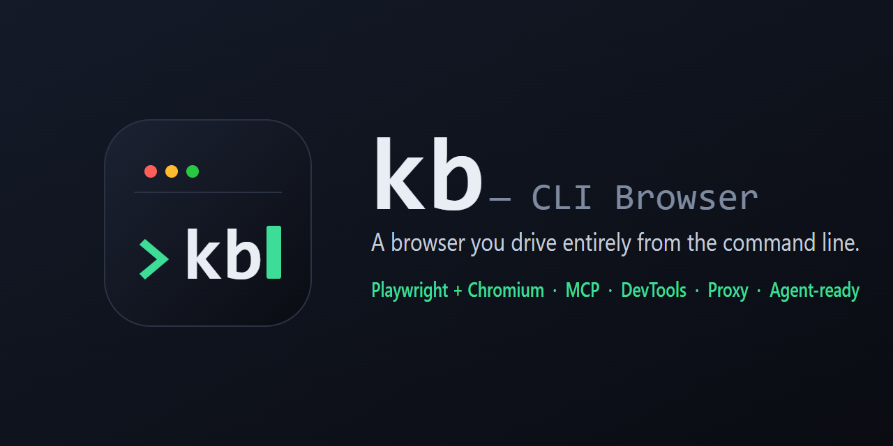

<p align="center">
  
</p>

<p align="center">
  <b>A browser you operate entirely from the command line.</b> Built on Playwright + Chromium (CDP).
</p>

<p align="center">
  <a href="LICENSE"></a>
  = 18">
  
  
</p>

日本語版は [README.ja.md](README.ja.md) を参照してください。

Everything a GUI browser gives you — page rendering, cookie management, DevTools operations (Network / Console / Elements) — is available as `kb` commands. FoxyProxy-style proxy profiles are built in, with **restart-free switching** and per-host routing rules. Designed to be driven by AI agents (Claude Code, etc.) via Bash or MCP, while the window is a real Chrome you can use by hand at any time.

> **Two workflows it's built for:**
> - **Drive it from an AI agent** — Claude Code and other agents operate kb over **MCP (23 tools)** or **Bash** (every command supports `--json`). The accessibility-snapshot + `--ref` loop is tuned for reliable, low-token automation, and the resident daemon returns each step in tens of milliseconds.
> - **Security research & bug-bounty recon** (authorized testing only) — session-shared HTTP, live network inspection/mocking, raw `eval` on authenticated SPAs, proxy chaining into Burp/Caido, two-account IDOR via profiles, and masked, shareable evidence bundles. See [Security research & bug-bounty recon](#security-research--bug-bounty-recon).

## Features

- **Daemon architecture** — the browser stays resident; every CLI command returns in tens of milliseconds
- **Real Chrome** — uses your installed Chrome/Edge (DRM works), falling back to bundled Chromium; pick explicitly with `--channel`, override the User-Agent with `--ua`, or present as a regular (non-automation) browser with `--stealth` for authorized testing
- **Attach to a running browser** — `kb daemon start --cdp http://127.0.0.1:9222` connects to a Chrome/Edge started with `--remote-debugging-port` and reuses its signed-in state
- **Agent-optimized** — `kb snapshot` returns an accessibility tree with element refs; `kb click --ref e12` acts on them reliably (including inside iframes), and stale refs are **auto re-resolved** to the element with the same role/name after re-renders. Long outputs (text / html / snapshot) are capped at 20,000 chars by default with `--offset` paging. `kb eval` accepts `await` and multi-line code as-is
- **DevTools from the terminal** — network log / response bodies (`kb net body`) / full headers (`kb net headers`) / request blocking / response mocking (including overriding live endpoints with error responses) / HAR recording / console / DOM inspection
- **Mini REST client** — `kb request` hits APIs directly without opening a page; cookies and proxy settings are shared with the browser (call authenticated APIs as-is)
- **Proxy profiles** — save `host:port` (+auth) as named profiles, switch instantly without restarting the browser, route specific hosts through specific proxies (FoxyProxy-style rules), SOCKS5 auth handled by the built-in relay (the relay itself is token-protected)
- **Headed ⇄ headless / profile switching** — tabs and cookies survive
- **Persistent sign-in** — log in once and the state is kept in the profile across sessions; `kb login` wraps the manual sign-in flow in one command, `kb storage dump / restore` exports it to a file
- **Operation recording** — commands, network, and console are journaled by default; `kb log export` produces a self-contained bundle (report + reproduction steps + standalone curl + screenshots) with sensitive values masked by default
- **Human-in-the-loop** — the agent automates, you take over for logins/CAPTCHAs, `kb wait` detects when you're done
- **MCP server** — `kb-mcp` exposes 23 tools (screenshots are returned as images)
- **`--json` everywhere** — machine-readable output for scripting and agents

## Install

```bash
npm install
npm run build
npm link        # makes kb / kb-mcp available globally
```

The browser binary is auto-selected: installed Chrome → Edge → Playwright's bundled Chromium (run `npx playwright install chromium` only if you need the bundled one).

## Quick start

```bash
kb open example.com        # daemon (browser) auto-starts
kb text                    # read the page as text
kb snapshot                # page structure with element refs
kb click --ref e6          # click reliably by ref
kb screenshot -o s.png
kb daemon stop             # quit the browser
```

Headed (visible window) by default. Cookies and login state persist under `~/.kb/profiles/`.

## Commands

| Category | Commands |
|---|---|
| Daemon | `kb daemon start [--headless] [--profile <n>] [--channel chrome\|msedge\|chromium] [--ua <s>] [--stealth] [--cdp <url>] / stop / status` |
| Pages | `kb open <url> [-n] [--wait idle]` / `kb tabs [close/switch <id>]` / `kb text` / `kb html` / `kb snapshot` / `kb screenshot [<sel>\|--ref e12] [-f] [--timeout <sec>]` (element-level supported) / `kb pdf` (headless only) |
| Navigation | `kb back` / `kb forward` / `kb reload` / `kb scroll [--to <sel>/--bottom]` |
| Interaction | `kb click` / `kb fill` / `kb select [--label]` / `kb check` / `kb uncheck` / `kb hover` / `kb upload <sel> <local file path...>` / `kb press <key>` / `kb eval <js> [--file f.js]` (`await` & multi-line OK; returns the last expression) — target via CSS selector, `--ref e12` (from snapshot), or `--frame <sel>` (inside iframe) |
| HTTP | `kb request <url> [-X POST] [-H "Name: value"] [-d body \| --data-file f] [-o file]` (page-independent; shares cookies & proxy with the browser) |
| Login | `kb login [url] [--until <glob>] [--save <file>]` (manual sign-in → state auto-saved to the profile) |
| Cookies / session | `kb cookies [list/get/set/rm/clear/export/import]` / `kb storage dump/restore` |
| Downloads | `kb downloads [list/clear]` (auto-saved under `~/.kb/downloads/`) |
| Network | `kb net log [-f] [--filter re] [--responses]` / `kb net body <seq>` (response body) / `kb net headers <seq>` (full headers) / `kb net block <glob>` / `kb net mock <glob> [--body f\|--text s] [--status n]` / `kb net unroute <id>\|--all` / `kb net har start/stop` |
| Console | `kb console [-f]` |
| Recording | `kb log [list]` / `kb log start [--name n] [--shots] / stop / status` / `kb log show/steps [--no-mask]` / `kb log export [-o dir]` / `kb log replay [n] [--dry-run]` / `kb log rm <n>` |
| DOM | `kb dom query <sel> [--html] [--attr name] [--frame <sel>]` (falls back to same-name DOM property — value / checked etc. — when the attribute is absent) |
| Proxy | `kb proxy add/rm/list/use/off/status/test` / `kb proxy rule add/rm/list` |
| Mode / profile | `kb mode headed\|headless` / `kb profile list/use <n>` (tabs & cookies restored) |
| Auth | `kb auth set <user> <pass>` / `kb auth clear` (HTTP Basic auth for target sites) |
| Waiting | `kb wait [--url <glob>] [--selector <sel>] [--idle] [--any]` (multiple conditions AND by default, `--any` for OR) |
| Emulation | `kb emulate ua/viewport/tz/geo/net/reset` (net: offline/slow3g/fast3g) |

All commands support `--json`. Long outputs are truncated at 20,000 chars by default; use `--offset <n>` for the next chunk or `--max-chars 0` for everything.

## Staying signed in

**Sign in once.** kb launches the browser with a persistent profile (`~/.kb/profiles/`), so cookies and localStorage survive daemon restarts. For the initial sign-in to a service, use `kb login`:

```bash
kb login github.com          # switches to headed, opens the page → sign in → press Enter
kb login myapp.example.com --until "**/dashboard**"   # auto-detect completion by URL (agent-friendly)
kb login github.com --save gh-state.json              # also back the state up to a file
```

Subsequent sessions start already signed in — nothing to do. A `--save`d file can be carried to another profile or machine with `kb storage restore <file>`.

Note: sites that rely purely on session cookies (no expiry) sign you out on browser restart, same as a regular browser. `kb storage dump / restore` covers that case too. `storage dump` exports **all cookies including HttpOnly** plus localStorage (Playwright storageState format).

To use two accounts at the same time, run a second daemon with its own `KB_HOME` (one daemon = one profile):

```bash
KB_HOME=~/.kb-alt kb daemon start --profile account2   # runs alongside as an independent daemon
```

## Attaching to a running browser

Connect to a Chrome / Edge started with `--remote-debugging-port` instead of launching a new one — its signed-in state, extensions, and settings are used as-is:

```bash
# 1. Start the target browser with CDP enabled (dedicated profile)
chrome --remote-debugging-port=9222 --user-data-dir="%LOCALAPPDATA%\kb-attach"

# 2. Attach kb to it
kb daemon start --cdp http://127.0.0.1:9222
kb tabs                    # existing tabs are visible as-is
kb open myapp.example.com  # everything works as usual from here
kb daemon stop             # disconnects only; the target browser stays open
```

Constraints:

- **Chrome 136+ disables remote debugging on the everyday default profile** (a security change). Start with a dedicated `--user-data-dir` as shown above and sign in to your services there once — the state sticks to that profile.
- Since kb can't change how the target browser was launched, `kb mode` / `kb profile` / `kb auth` and kb's proxy-profile switching are unavailable while attached (they return a clear error).
- Everything else — open / click / snapshot / eval / screenshot / net log / net body / cookies / storage — works.

## API debugging

When your API returns something unexpected, read the body right away — no HAR recording needed:

```bash
kb net log --filter "api"    # note the #seq at the start of each line
kb net body 42               # print that response body (JSON reads as-is)
kb net headers 42            # all request/response headers (cookies, cache-control, …)
```

To see how the UI handles errors, override a live endpoint in place:

```bash
kb net mock "**/api/users" --status 500 --text '{"error":"internal"}'   # matching requests now return 500
kb reload                                                               # inspect the error state
kb net unroute 1                                                        # back to normal
```

Bodies are captured automatically for text-like (JSON / HTML / JS / XML …) XHR / fetch / document responses. Capture is truncated at **256 KB per response** (32 MB / 500 entries total, oldest evicted first): `--offset` pages within the captured part, but anything beyond 256 KB is not recoverable afterwards — if you need the full body of a large response, re-fetch it with `kb request <url> -o <file>`.

To hit an endpoint directly, use `kb request` (a mini REST client):

```bash
kb request localhost:3000/api/users                    # GET
kb request localhost:3000/api/users -X POST -d '{"name":"a"}'   # JSON bodies get Content-Type: application/json automatically
kb request api.example.com/v2/me -H "Accept: application/vnd.api+json" -H "X-Api-Version: 2"
```

Explicit `-H` headers always win (JSON auto-detection only kicks in when Content-Type is unset).

No page needed, and **cookies & proxy settings are shared with the browser** — if you're logged in in the browser, authenticated APIs just work, and `Set-Cookie` responses flow back into the browser. Save binary responses with `-o <file>`.

## Operation recording & shareable bundles

The daemon **records operations by default** (commands, xhr/fetch/document traffic, console output). After a work session, one command produces a self-contained bundle that **someone without kb can read and reproduce**:

```bash
kb log export                 # generates ./kb-log-<session>/
kb log export -o out --no-mask --allow "^cookie$" --deny "internal\.corp"
```

```
kb-log-<session>/
├─ report.md      # numbered steps + per-step network/console + screenshots (start here)
├─ steps.md       # reproduction steps (kb command list)
├─ events.jsonl   # masked journal (machine-readable)
├─ requests/      # each request as a standalone curl .sh
├─ shots/         # screenshots
└─ meta.json      # session info
```

**Sensitive values are masked by default** (`[MASKED]`): fill inputs, eval return values, Authorization / Cookie headers, password / token-like keys in bodies, and **sensitive keys in URL query strings** (`?api_key=…`, including Location / Referer headers and URLs inside bodies). Unmask with an explicit `--no-mask`; fine-tune with `--allow` / `--deny` (regex). **The local raw journal (`~/.kb/logs/`) is never modified** — masking applies only at export / show time, so reports can be regenerated anytime.

Caveats: `eval` expressions and `net mock --text` arguments are recorded verbatim (masking targets values, not the code you wrote) — use `--deny <regex>` before sharing if you inlined secrets. The **raw journal keeps sensitive values in plaintext**, so always share via export. Old sessions are pruned automatically at daemon start (default: keep 20, configurable via `KB_LOG_KEEP`).

Known limit: values embedded in **URL path segments** (`/verify/<value>` — no key name to detect) are not auto-masked (nested URLs in query strings *are* masked recursively). Use `--deny <regex>` for those.

Sessions split automatically per daemon run, or explicitly with `kb log start --name <n>` (add `--shots` to auto-capture a screenshot after every action — they show up in report.md). Use `kb log show` for recent events and `kb log steps` for a numbered reproduction script.

Recorded operations can be **replayed as-is**:

```bash
kb log replay              # re-run the latest session's actions in order (tab ids map to the active tab)
kb log replay mysession --dry-run          # preview what would run
kb log replay mysession --from 5 --continue-on-error
```

Because replay remaps tab ids to the current active tab, **recordings spanning multiple tabs may not reproduce exactly** (single-tab flows are the target).

## Proxy profiles (FoxyProxy-style)

```bash
kb proxy add work --type http --host 10.0.0.1 --port 8080 --user u --pass p --bypass "*.internal"
kb proxy use work                              # applied instantly, no browser restart
kb proxy rule add "*.corp.example.com" work    # route only this host through work (first match wins)
kb proxy test                                  # verify via external IP + latency
kb proxy status                                # what the daemon is actually using
```

How it works: Chromium always points at a local relay proxy inside the daemon; switching only swaps the relay's upstream. That's why no restart is needed, and why SOCKS5 authentication (which Chromium doesn't support natively) works — the relay handles it. The relay itself requires a per-session token, so other local processes can't ride it.

Common upstream setups:

```bash
# Working behind a corporate proxy (with auth, internal hosts direct)
kb proxy add corp --type http --host proxy.corp.example.com --port 8080 \
  --user myuser --pass mypass --bypass "*.internal,localhost"
kb proxy use corp

# Developing through a local mitmproxy / mock server
kb proxy add local --type http --host 127.0.0.1 --port 8081
kb proxy use local     # applied instantly, no restart
kb proxy off           # back to direct (also instant)
```

When a connection fails (the browser shows `ERR_TUNNEL_CONNECTION_FAILED`), `kb proxy status` lists the recent connection errors (target host, profile used, cause), and they are logged to `~/.kb/daemon.log`.

## Driving it from an AI agent

**From Claude Code, MCP is the recommended way** — native tools, no Bash output parsing:

```bash
claude mcp add kb -- kb-mcp
```

Exposes `kb_snapshot`, `kb_open`, `kb_text`, `kb_screenshot` (returns an image), `kb_click`, `kb_fill`, `kb_select`, `kb_eval`, `kb_request`, `kb_net_log`, `kb_net_body`, `kb_net_headers`, `kb_proxy_use`, and more — 23 tools.

**Via Bash** everything is available too (every command supports `--json`, with symmetric `{ok:true,result}` / `{ok:false,error}`). The recommended loop:

```bash
kb open example.com --wait idle   # use idle for SPAs
kb snapshot                       # discover elements with refs
kb click --ref e12                # act (returns the resulting URL/title)
kb text                           # read the outcome
```

**One-shot actions to cut round-trips**: when the target is identifiable by text, skip the snapshot — Playwright's selector engines work directly:

```bash
kb click "text=Save"                       # text match in one command
kb click "role=button[name='Save']"        # role + accessible name
```

With refs, a ref that went stale after a re-render is auto re-resolved to the element with the same role/name, so you only re-snapshot on failure.

**Human-in-the-loop**: for logins or CAPTCHAs, the user just uses the window directly; the agent resumes after `kb wait --url "**dashboard**"` succeeds. The initial sign-in flow is packaged as `kb login`.

## Security research & bug-bounty recon

kb is a capable driver for **authorized** security testing and bug-bounty reconnaissance — all from the commands documented above:

- **Authenticated API testing / IDOR** — `kb request` shares the browser's cookies and proxy, so you probe authz-protected endpoints as the logged-in user; run two accounts side by side with separate profiles (or two daemons via `KB_HOME`) to diff object access.
- **Runtime recon on SPAs** — `kb eval` runs arbitrary JS in the page context and returns raw values (cookies, tokens, client-side route tables) without redaction — handy for confirming DOM XSS or extracting client config.
- **Traffic inspection & tampering** — `kb net log / body / headers` reads captured requests and responses; `kb net mock / block` rewrites them in place to probe error handling and client-side trust.
- **Proxy chaining** — point kb's upstream at Burp or Caido and route all traffic through your intercepting proxy, switchable without a restart.
- **Attach to a real signed-in session** — `--cdp` reuses a Chrome you signed into by hand (SSO / 2FA / passkey), so real-auth targets work without re-login.
- **Reproducible evidence** — `kb log export` produces a **secret-masked** bundle (report + steps + standalone curl + screenshots) you can attach to a report.
- **Agent-driven, headless** — sub-agents can run recon in parallel against the resident daemon.

> **Test only what you're authorized to.** Follow each program's rules of engagement — many bug-bounty programs prohibit automated scanning, aggressive request rates, or evading their anti-bot / WAF controls. kb is a driver, not a licence: confirm scope and policy first.

## Architecture

```
kb (CLI) ──HTTP+token──▶ daemon ── Playwright persistent context ──▶ Chrome/Edge/Chromium
kb-mcp (MCP stdio) ──┘      └─ local relay proxy (token auth) ──▶ upstream proxies (profiles/rules)
```

State lives in `~/.kb/` (daemon.json / proxies.json / profiles/ / downloads/ / daemon.log).

## Development

```bash
npm test    # build + unit tests (node:test)
```

## License

MIT
